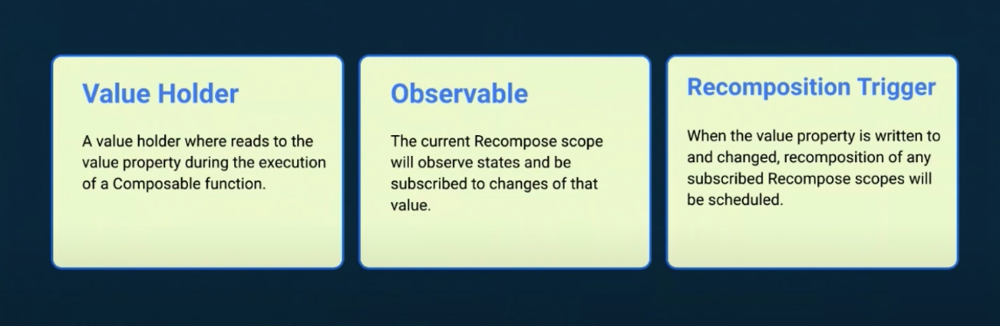
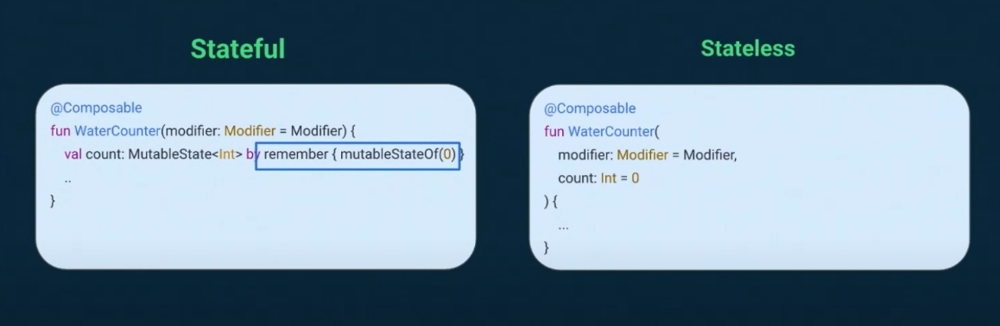

# Android

안드로이드 TIL

## Compose

### What's the State?

State 는 3가지의 역할을 수행하는데 이는 Flutter 의 StatefulWidget 과 유사하다. Compose 도 State 를 가진 Composable, State가 없는 Composable이 있다.

### Stateful vs Stateless

구글 가이드라인에 따르면 최대한 Stateless composable로 작성하도록 한다.

### Why Stateless?

- State를 제공하는 호출자 쪽에서 데이터 소스를 단일화하여 소스를 공급하는 객체가 유일하다는 것을 보장한다. 
- 외부에 State 를 알수 없도록 캡슐화를 할수 있다.
- State 와 독립적으로 사용되기 때문에 결과적으로 재사용성이 높다.

### State hoisting

Stateful 을 Stateless 로 변경하는 것

